# DAYFLOW HRMS — FINAL QA & VERIFICATION REPORT

**Project:** Dayflow — Human Resource Management System  
**Event:** Odoo × NMIT Bangalore Hackathon 2026  
**QA Lead:** Vardhan  
**Date:** 22 August 2026  
**Target Environment:** `http://localhost:8069` (Docker Compose / Odoo 17 + PostgreSQL 15)  

---

## 1. Executive Summary

A comprehensive Quality Assurance and end-to-end functional test suite was executed across all user roles (Employee & HR/Admin), security boundaries, and API integrations for Dayflow HRMS by **Vardhan**.

All functional workflows, role-based access control (RBAC), database persistence, state transitions, and neo-brutalist UI components have passed rigorous testing with zero critical blockers.

---

## 2. Test Execution Breakdown

### Part 2 — Employee QA
| Test Item | Description | Result | Details |
| :--- | :--- | :---: | :--- |
| **Login** | Native auth with `employee.one@dayflow.org` | **PASS** | Successfully authenticated, token stored, session set |
| **Session Restoration**| Reload & direct routing | **PASS** | Session persists across navigation |
| **Dashboard** | Profile & metrics cards | **PASS** | Rendered live backend data (Real Employee One, `EMP_REAL_01`) |
| **Profile** | User details & metadata | **PASS** | Role, employee code, department correctly mapped |
| **Check In / Check Out** | Attendance state management | **PASS** | Attendance logs tracked and displayed with accurate timestamps |
| **Attendance History** | Modal & log entries | **PASS** | Full chronological attendance ledger displayed |
| **Apply Leave** | Leave application modal | **PASS** | Submissions persist to backend; updates pending counter |
| **Leave History** | Status & historical requests | **PASS** | Shows newly submitted requests with `PENDING` state |
| **Payroll** | Salary slip modal & statement | **PASS** | Restricted view rendered; clean empty/published state |
| **Logout** | Session termination | **PASS** | Session cleared; redirects to authentication screen |

---

### Part 3 — HR / Admin QA
| Test Item | Description | Result | Details |
| :--- | :--- | :---: | :--- |
| **Login** | Native auth with `admin.one@dayflow.org` | **PASS** | Successfully authenticated as HR Administrator |
| **HR Dashboard** | High-level metrics & control center | **PASS** | Real-time counts of employees, pending leaves, attendance |
| **Employee Directory**| Full employee roster modal | **PASS** | Complete list of registered staff with designations |
| **Attendance Overview**| Departmental attendance logs | **PASS** | Verified live check-in logs and timestamps |
| **Pending Leave Requests**| Approvals queue | **PASS** | Shows pending employee requests with action triggers |
| **Approve Leave** | State transition to APPROVED | **PASS** | Approving updates database state and decrements queue |
| **Reject Leave** | State transition to REJECTED | **PASS** | Rejection workflow tested and verified |
| **Payroll Management** | View & manage salary statements | **PASS** | HR access enabled to overview payroll distribution |
| **Logout** | Session termination | **PASS** | Secure logout and session teardown |

---

### Part 4 — Security & RBAC QA
| Security Boundary | Expected Behavior | Result | Notes |
| :--- | :--- | :---: | :--- |
| **Employee Isolation** | Employee cannot view other employees' records | **PASS** | Enforced at API and UI level |
| **Payroll Restriction** | Employee cannot view organization payroll | **PASS** | Strict scoping to logged-in user |
| **HR Directory Restriction**| Employee cannot access admin directory controls | **PASS** | Admin-only modal & endpoint protection |
| **Leave Approval Restriction**| Employee cannot approve/reject leave requests | **PASS** | Action buttons and handlers restricted to HR role |
| **HR Admin Elevation** | HR can inspect directory, attendance & leaves | **PASS** | Full role permissions validated |

---

### Part 5 — UI & UX QA (Neo-Brutalist Design)
- **Visual Integrity:** Clean high-contrast borders, bold typography, no overlapping cards or clipped text.
- **Modals & Forms:** All modals open smoothly, accept input validation, and close correctly.
- **Console Errors:** Inspected via Chrome DevTools F12; zero unhandled exceptions, zero 500 errors.
- **Responsive Layout:** Adaptive card grids and high-visibility action buttons.

---

### Part 6 — Complete Demo Flow

```mermaid
flowchart TD
    subgraph Employee Flow
        E1[Login as Employee] --> E2[View Dashboard]
        E2 --> E3[Check Attendance History]
        E3 --> E4[Apply for Leave]
        E4 --> E5[Verify Leave in History]
        E5 --> E6[View Salary Slip]
        E6 --> E7[Logout]
    end

    subgraph HR Admin Flow
        A1[Login as Admin] --> A2[Review Admin Dashboard]
        A2 --> A3[Check Employee Directory]
        A3 --> A4[Inspect Attendance Logs]
        A4 --> A5[Open Leave Approvals]
        A5 --> A6[Approve Pending Leave]
        A6 --> A7[Inspect Payroll Module]
        A7 --> A8[Logout]
    end
```

**Demo Flow Result: PASS** (Tested autonomously from start to finish without intervention).

---

## 3. Final QA Verdict

```
==================================================
           DAYFLOW HRMS FINAL QA VERDICT           
==================================================
                    DEMO READY                    
==================================================
```

- **QA Lead:** Vardhan
- **Critical Bugs:** 0
- **Blockers:** None
- **System Stability:** Verified (Odoo 17 + PostgreSQL 15 Containerized)
- **Role Verification:** Verified (Employee & HR Admin)

